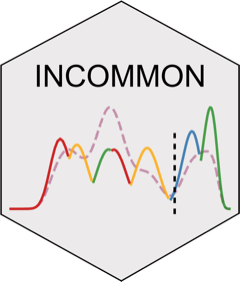

<!-- README.md is generated from README.Rmd. Please edit that file -->

```{r, include = FALSE}
knitr::opts_chunk$set(
  collapse = TRUE,
  comment = "#>",
  fig.path = "man/figures/README-",
  out.width = "100%"
)
```

<!-- badges: start -->
[](https://github.com/caravagnalab/INCOMMON/actions/workflows/R-CMD-check.yaml)
[](https://github.com/caravagnalab/INCOMMON/actions/workflows/pkgdown.yaml)
[](https://lifecycle.r-lib.org/articles/stages.html#experimental)
[](https://www.semanticscholar.org/paper/2d5318baf1a79d491822e5d98a1e06028f521fbc)
[](https://github.com/caravagnalab/INCOMMON/stargazers)
<!-- badges: end -->

# INCOMMON <a href='https://caravagnalab.github.io/INCOMMON'></a>

INCOMMON is a tool for the INference of COpy number and Mutation Multiplicity in ONcology.
INCOMMON infers the copy number and multiplicity of somatic mutations from tumor-only read count data,
and can be applied to classify mutations from large-size datasets in an efficient and fast way.

INCOMMON is also available as a user-friendly [ShinyApp](https://ncalonaci.shinyapps.io/incommon/) (see [this vignette](https://caravagnalab.github.io/INCOMMON/articles/a6_shiny_app.html) for a brief overview of what it offers).

You can download the results of our analysis from [Zenodo](https://zenodo.org/records/12547426).

#### Citation

Check out our preprint on [medRxiv](https://doi.org/10.1101/2024.05.13.24307238)!

[](https://doi.org/10.1101/2024.05.13.24307238)

#### Help and support

[](https://caravagnalab.github.io/INCOMMON)

------------------------------------------------------------------------

### Installation

You can install INCOMMON from [GitHub](https://github.com/) with:

``` r
# install.packages("devtools")
devtools::install_github("caravagnalab/INCOMMON")
```

------------------------------------------------------------------------

#### Copyright and contacts

Cancer Data Science (CDS) Laboratory. University of Trieste, Italy.

[](https://github.com/caravagnalab)
[](https://www.caravagnalab.org/)
