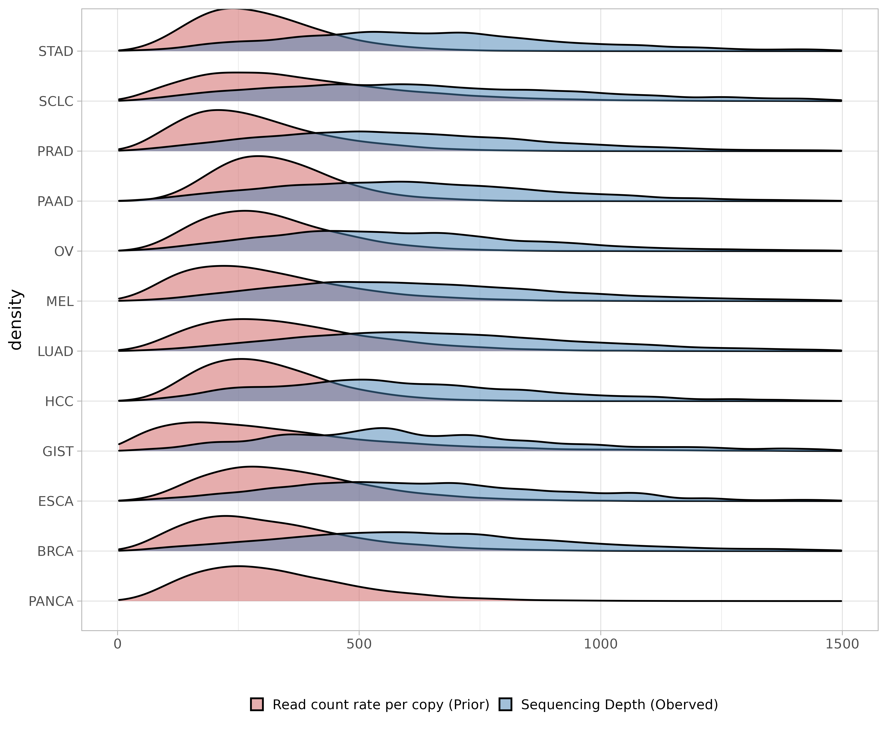
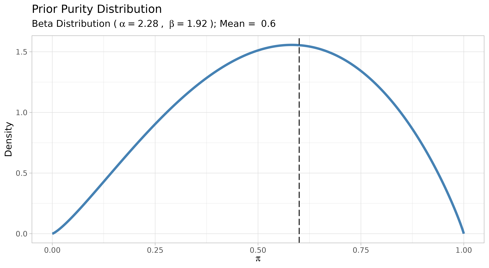
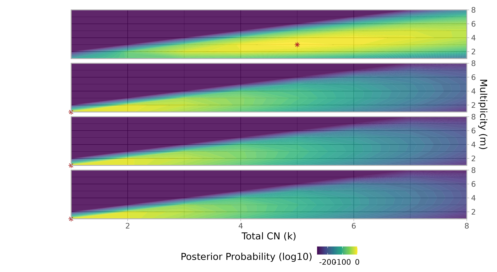

# 2. Inference of mutation copy number and multiplicity

``` r

library(INCOMMON)
#> Warning: replacing previous import 'cli::num_ansi_colors' by
#> 'crayon::num_ansi_colors' when loading 'INCOMMON'
library(dplyr)
#> 
#> Attaching package: 'dplyr'
#> The following objects are masked from 'package:stats':
#> 
#>     filter, lag
#> The following objects are masked from 'package:base':
#> 
#>     intersect, setdiff, setequal, union
library(DT)
library(cli)
library(crayon)
#> 
#> Attaching package: 'crayon'
#> The following object is masked from 'package:cli':
#> 
#>     num_ansi_colors
```

In this vignette, we use INCOMMON to infer the copy number and
multiplicity of mutations from a single sample of the MSK-MetTropsim
dataset provided within the package.

## 2.1 Input preparation

The minimal input for INCOMMON analyses consists of two pieces.

### 2.1.1 Genomic data

First we need a table of `genomic_data` (mutations) with required
columns `chr`, `from`, `to`, `ref`, `alt`, `DP`, `NV`, `VAF`, and
`gene`.

The following example is taken from the internal dataset obtained from
the MSK-MetTropism cohort:

### 2.1.2 Clinical data

Second, we need a table of clinical data with at least the columns
`sample` (sample names matching the ones in `genomic_data`), `purity`
(purity of each sample) and `tumor_type` (annotated tumour type of the
sample), required for using tumour-specific priors. The following
example is taken from the internal dataset obtained from the
MSK-MetTropism cohort:

### 2.1.3 Initialisation of the input

The first thing to do is to initialise the input so that we will have it
in INCOMMON format, through function `init`. This function takes as
input the tables of `genomic_data` and `clinical_data`, plus optionally,
a list of gene roles.

INCOMMON provides a default list `cancer_gene_census` obtained from the
COSMIC Cancer Gene Census v.98. The required format is as following:

We now can create the input INCOMMON object through the function `init`:

``` r

x = init(genomic_data = MSK_genomic_data, 
         clinical_data = MSK_clinical_data, 
         gene_roles = cancer_gene_census)
#> ── INCOMMON - Inference of copy number and mutation multiplicity in oncology ───
#> 
#> ── Genomic data ──
#> 
#> ✔ Found 25659 samples, with 224939 mutations in 491 genes
#> ! No read counts found for 1393 mutations in 1393 samples
#> ! Gene name not provided for 1393 mutations
#> ! 201 genes could not be assigned a role (TSG or oncogene)
#> 
#> ── Clinical data ──
#> 
#> ℹ Provided clinical features:
#> ✔ sample (required for classification)
#> ✔ purity (required for classification)
#> ✔ tumor_type
#> ✔ OS_MONTHS
#> ✔ OS_STATUS
#> ✔ SAMPLE_TYPE
#> ✔ MET_COUNT
#> ✔ METASTATIC_SITE
#> ✔ MET_SITE_COUNT
#> ✔ PRIMARY_SITE
#> ✔ SUBTYPE_ABBREVIATION
#> ✔ GENE_PANEL
#> ✔ SEX
#> ✔ TMB_NONSYNONYMOUS
#> ✔ FGA
#> ✔ AGE_AT_SEQUENCING
#> ✔ RACE
#> ✔ Found 25257 matching samples
#> ✖ Found 513 unmatched samples

print(x)
#> ── [ INCOMMON ]  223546 PASS mutations across 24266 samples,
#> with 490 mutant gen
#> ℹ Average sample purity: 0.4
#> ℹ Average sequencing depth: 660
#> # A tibble: 223,546 × 27
#>    sample    tumor_type purity chr     from     to ref   alt      DP    NV   VAF
#>    <chr>     <chr>       <dbl> <chr>  <dbl>  <dbl> <chr> <chr> <int> <int> <dbl>
#>  1 P-0028912 CHOL          0.3 chr17 7.58e6 7.58e6 G     A       837   133 0.159
#>  2 P-0028912 CHOL          0.3 chr6  1.12e8 1.12e8 -     A       698   141 0.202
#>  3 P-0028912 CHOL          0.3 chrX  5.32e7 5.32e7 G     A       832    85 0.102
#>  4 P-0003698 BLCA          0.2 chr17 7.58e6 7.58e6 C     A       437   109 0.249
#>  5 P-0003698 BLCA          0.2 chr3  4.99e7 4.99e7 C     A       591    86 0.146
#>  6 P-0003698 BLCA          0.2 chr5  1.49e8 1.49e8 C     T       360    36 0.1  
#>  7 P-0003698 BLCA          0.2 chr13 3.29e7 3.29e7 G     C      1027   162 0.158
#>  8 P-0003698 BLCA          0.2 chr13 3.29e7 3.29e7 G     C      1021   182 0.178
#>  9 P-0003698 BLCA          0.2 chr19 1.11e7 1.11e7 G     T       573    98 0.171
#> 10 P-0003698 BLCA          0.2 chr22 4.15e7 4.15e7 G     A       416    45 0.108
#> # ℹ 223,536 more rows
#> # ℹ 16 more variables: gene <chr>, gene_role <chr>, OS_MONTHS <dbl>,
#> #   OS_STATUS <dbl>, SAMPLE_TYPE <chr>, MET_COUNT <dbl>, METASTATIC_SITE <chr>,
#> #   MET_SITE_COUNT <dbl>, PRIMARY_SITE <chr>, SUBTYPE_ABBREVIATION <chr>,
#> #   GENE_PANEL <chr>, SEX <chr>, TMB_NONSYNONYMOUS <dbl>, FGA <dbl>,
#> #   AGE_AT_SEQUENCING <dbl>, RACE <chr>
```

The MSK-MET dataset comprises 25257 samples with matched clinical data.
The average sequencing depth is 649 and the average sample purity is
0.4. The 175054 mutations flagged as PASS are the ones that satisfy the
requirements for INCOMMON classification: available and non-negative
sample purity; integer sequencing depth and number of reads with the
variant, character gene names etc.

## 2.2 Inference of copy number and mutation multiplicity

In principle, INCOMMON can infer any configuration of total copy number
`k` and mutation multiplicity `m`, given that both `k` and `m` are
integer numbers and $`m\leq k`$. Since there is an infinite number of
such possible configurations, a maximum value `k_max` of `k`, expected
to be found in the dataset, must be set up prior to the classification
task. By default, INCOMMON uses $`k_{max}=8`$.

### 2.2.1 Rate of read counts per chromosome copy

INCOMMON is a Bayesian model that infers mutation copy number and
multiplicity from read counts. An essential parameter of the model is
the rate of read counts per chromosome copy $`\eta`$. To guide the
inference of this parameter, we use a Gamma prior distribution. The only
a priori information that we have access to is on the $`(k,m)`$
configurations of mutant genes. We use this to compute a prior
distribution over $`\eta`$ from the dataset itself, using the
function`compute_eta_prior`

``` r

data('priors_pcawg_hmf')

priors_eta = compute_eta_prior(x = x, priors_k_m = priors_pcawg_hmf)
print(priors_eta)
#> # A tibble: 12 × 6
#>    tumor_type mean_eta var_eta     N alpha_eta beta_eta
#>    <chr>         <dbl>   <dbl> <int>     <dbl>    <dbl>
#>  1 BRCA           319.  30947.  2283      3.28  0.0103 
#>  2 ESCA           355.  29910.   289      4.21  0.0119 
#>  3 GIST           340.  61998.   299      1.87  0.00549
#>  4 HCC            303.  16680.   175      5.50  0.0182 
#>  5 LUAD           351.  33989.  3412      3.63  0.0103 
#>  6 MEL            306.  29548.  1044      3.17  0.0104 
#>  7 OV             314.  19617.   937      5.04  0.0160 
#>  8 PAAD           333.  15043.  1698      7.37  0.0221 
#>  9 PRAD           283.  20687.   283      3.88  0.0137 
#> 10 SCLC           372.  45882.   255      3.01  0.00811
#> 11 STAD           291.  16017.    97      5.27  0.0181 
#> 12 PANCA          331.  29117. 10838      3.75  0.0114
```

For each tumour type in the dataset, we estimated the empirical mean and
variance of $`\eta`$, which can be straightforwardly transformed into
the shape parameters $`\alpha_\eta`$ and $`\beta_eta`$ of a Gamma
distribution.

We can visualise the prior distribution for each tumour type using the
function `plot_eta_prior`:

``` r

plot_eta_prior(x = x, priors_eta = priors_eta)
```

 The
plot shows, for each tumour type and at the pan-cancer level (PANCA),
the distribution of total read counts, potentially confused by diverse
copy-number configurations and sample purities, and the underlying prior
distribution of the rate of read counts per chromosome copy.

### 2.2.2 Inference in sample ‘P-0002081’

We now focus on a specific sample:

``` r

sample = 'P-0002081'

x = subset_sample(x = x, sample_list = c(sample))

print(x)
#> ── [ INCOMMON ]  4 PASS mutations across 1 samples,
#> with 4 mutant genes across 7
#> ℹ Average sample purity: 0.4
#> ℹ Average sequencing depth: 660
#> # A tibble: 4 × 27
#>   sample    tumor_type purity chr      from     to ref   alt      DP    NV   VAF
#>   <chr>     <chr>       <dbl> <chr>   <dbl>  <dbl> <chr> <chr> <int> <int> <dbl>
#> 1 P-0002081 LUAD          0.6 chr12  2.54e7 2.54e7 C     A       743   378 0.509
#> 2 P-0002081 LUAD          0.6 chr17  7.58e6 7.58e6 G     A       246   116 0.472
#> 3 P-0002081 LUAD          0.6 chr19  1.22e6 1.22e6 C     A       260   122 0.469
#> 4 P-0002081 LUAD          0.6 chr19  1.11e7 1.11e7 -     C       271   133 0.491
#> # ℹ 16 more variables: gene <chr>, gene_role <chr>, OS_MONTHS <dbl>,
#> #   OS_STATUS <dbl>, SAMPLE_TYPE <chr>, MET_COUNT <dbl>, METASTATIC_SITE <chr>,
#> #   MET_SITE_COUNT <dbl>, PRIMARY_SITE <chr>, SUBTYPE_ABBREVIATION <chr>,
#> #   GENE_PANEL <chr>, SEX <chr>, TMB_NONSYNONYMOUS <dbl>, FGA <dbl>,
#> #   AGE_AT_SEQUENCING <dbl>, RACE <chr>
```

The input data table contains 4 mutations affecting KRAS, TP53, STK11
and SMARCA4 genes. In this sample, all 4 mutations have all the required
information. We can see that this is a sample of a metastatic lung
adenocarcinoma (LUAD), sequenced through the MSK-IMPACT targeted panel
version 341, with an estimated purity of 0.6.

INCOMMON models the sample purity probabilistically, centering a Beta
prior around the estimate provided with each sample (usually from a
histopathological assay). The variance $`\sigma_{\pi}^2`$ of the
distribution must be fixed prior to the classification task through the
argument `purity_error`. By default, INCOMMON uses
$`\sigma_{\pi}^2=0.05`$, accounting for uncertainty values of around
$`\simeq 10\%`$, depending on the mean.

The prior purity distribution for a sample can be visualised using the
function `plot_purity_prior`.

``` r

plot_purity_prior(x = x, sample = sample, purity_error = 0.05)
#> Warning: Using `size` aesthetic for lines was deprecated in ggplot2 3.4.0.
#> ℹ Please use `linewidth` instead.
#> ℹ The deprecated feature was likely used in the INCOMMON package.
#>   Please report the issue at <https://github.com/caravagnalab/INCOMMON/issues>.
#> This warning is displayed once per session.
#> Call `lifecycle::last_lifecycle_warnings()` to see where this warning was
#> generated.
```



The shape parameters of the Beta distribution ensure that the mean and
the variance correspond to the values we provided. The dashed line
indicate the input purity estimate, used as the mean of the
distribution.

We are now ready to run the classification step through function
`classify`, using the priors we obtained for $`(k,m)`$ configurations,
read count rate per chromosome copy $`\eta`$ and sample purity $`\pi`$.
We must provide the number of CPU cores `num_cores` we want to use for
the parallel MCMC sampling chains, as well as the number of iterations
for the warm-up (`iter_warmup`) and the proper sampling
(`iter_sampling`) steps. We also must specify paths for the directories
where we want to store the results (`results_dir`), the `stan` fit
objects (`stan_fit_dir`) in case we want to store them
(`stan_fit_dump = TRUE`) and, in case we want to generate a reporting
summary plot (`generate_report_plot = TRUE`), the directory where to
store the images (`reports_dir`).

> `classify` fits the model with
> [`cmdstanr`](https://mc-stan.org/cmdstanr/), which is not installed
> automatically with INCOMMON. If you haven’t set it up yet, run
> `install.packages("cmdstanr", repos = c("https://mc-stan.org/r-packages/", getOption("repos")))`
> followed by
> [`cmdstanr::install_cmdstan()`](https://mc-stan.org/cmdstanr/reference/install_cmdstan.html)
> before continuing, or use the [INCOMMON web
> app](https://ncalonaci.shinyapps.io/incommon/) instead, which requires
> no local installation.

``` r

out = classify(
  x = x,
  k_max = 8,
  priors_k_m = priors_pcawg_hmf,
  priors_eta = priors_eta,
  purity_error = 0.05,
  num_cores = 4,
  iter_warmup = 1000,
  iter_sampling = 2000,
  num_chains = 4
)
```

``` r

print(out)
#> ── [ INCOMMON ]  4 PASS mutations across 1 samples,
#> with 4 mutant genes across 1
#> ℹ Average sample purity: 0.6
#> ℹ Average sequencing depth: 380
#> # A tibble: 4 × 36
#>   sample    tumor_type purity purity_map eta_map chr     from     to gene  ref  
#>   <chr>     <chr>       <dbl>      <dbl>   <dbl> <chr>  <dbl>  <dbl> <chr> <chr>
#> 1 P-0002081 LUAD          0.6      0.645    190. chr12 2.54e7 2.54e7 KRAS  C    
#> 2 P-0002081 LUAD          0.6      0.645    190. chr17 7.58e6 7.58e6 TP53  G    
#> 3 P-0002081 LUAD          0.6      0.645    190. chr19 1.22e6 1.22e6 STK11 C    
#> 4 P-0002081 LUAD          0.6      0.645    190. chr19 1.11e7 1.11e7 SMAR… -    
#> # ℹ 26 more variables: alt <chr>, NV <int>, DP <int>, VAF <dbl>, map_k <int>,
#> #   map_m <int>, gene_role <chr>, OS_MONTHS <dbl>, OS_STATUS <dbl>,
#> #   SAMPLE_TYPE <chr>, MET_COUNT <dbl>, METASTATIC_SITE <chr>,
#> #   MET_SITE_COUNT <dbl>, PRIMARY_SITE <chr>, SUBTYPE_ABBREVIATION <chr>,
#> #   GENE_PANEL <chr>, SEX <chr>, TMB_NONSYNONYMOUS <dbl>, FGA <dbl>,
#> #   AGE_AT_SEQUENCING <dbl>, RACE <chr>, bayes_p_purity <dbl>,
#> #   bayes_p_eta <dbl>, post_pred_p.value_DP <dbl>, …
```

The output contains the maximum-a-posteriori (MAP) values of sample
purity (`purity_map`), which is close to the input value (0.578 vs 0.6),
read count rate per chromosome copy (`eta_map`) around 163, total copy
number (`map_k`) and multiplicity (`map_m`).

The only mutant oncogene in the sample is KRAS, that is found in 8
copies, 5 of which mutated, whereas all the TSGs (TP53, SMARCA4, STK11)
are in LOH, with only 1 mutant copy and total loss of the WT allele.
These inferred values are consistent with the read counts with and
without the variant and the estimated proportions of normal and tumour
cells in the sample.

## 2.3 Visualising INCOMMON inference

Since INCOMMON is a Bayesian method, it provides more than point
estimates for the quantities it infers. Instead, a full posterior
distribution is evaluated.

For example, here we visualise the posterior distribution of copy number
and multiplicity for the 4 mutant genes found in the analysed sample,
using the function `plot_posterior_k_m`.

``` r

plot_posterior_k_m(x = out, k_max = out$parameters$k_max)
```



For KRAS, most of the probability mass is located at configurations of
high total copy number with gain of the mutant allele. Conversely for
the TSGs SMARCA4, STK11 and TP53, the posterior probability tends to
accumulate on configurations of low total copy number with loss of the
WT allele. The red markers indicate the MAP values reported in the above
section.
