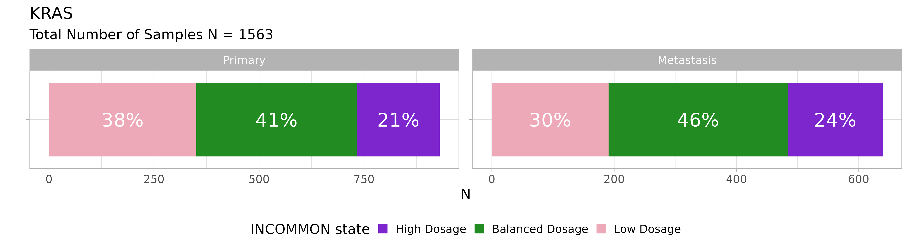
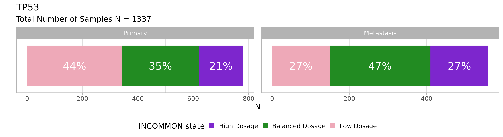

# 3. Gene mutant dosage

``` r

library(INCOMMON)
#> Warning: replacing previous import 'cli::num_ansi_colors' by
#> 'crayon::num_ansi_colors' when loading 'INCOMMON'
library(dplyr)
#> 
#> Attaching package: 'dplyr'
#> The following objects are masked from 'package:stats':
#> 
#>     filter, lag
#> The following objects are masked from 'package:base':
#> 
#>     intersect, setdiff, setequal, union
library(cli)
```

Downstream of copy number and multiplicity inference, INCOMMON can
interpret the mutant genome in terms of the mutant dosage of tumour
suppressor genes (TSGs) and oncogenes.

Full inactivation of TSG is detected as mutations high mutant dosage,
resulting from pure loss of heterozygosity (LOH) or copy-neutral LOH
(CNLOH). Full activation of oncogenes is also identified as mutations
with high mutant dosgae, resulting from copy gains of the mutant allele.

## 3.1 Genome interpretation of 1779 pancreatic adenocarcinoma samples

### 3.1.1 INCOMMON classification

We have used INCOMMON to make the inference on all prostate cancer
(PRAD) samples from the MSK-MET cohort. The results are sored in
`MSK_PRAD_output`. The package provides these example data

``` r

data("MSK_PAAD_output")
print(MSK_PAAD_output$input)
#> # A tibble: 7,839 × 186
#>    sample    tumor_type purity chr     from     to ref   alt      NV    DP gene 
#>    <chr>     <chr>       <dbl> <chr>  <dbl>  <dbl> <chr> <chr> <int> <int> <chr>
#>  1 P-0000142 PAAD          0.4 chr12 2.54e7 2.54e7 C     C       273  1404 KRAS 
#>  2 P-0000142 PAAD          0.4 chr17 7.58e6 7.58e6 G     G        53   671 TP53 
#>  3 P-0000142 PAAD          0.4 chr2  4.77e7 4.77e7 T     T        31   481 MSH2 
#>  4 P-0000142 PAAD          0.4 chr5  1.28e6 1.28e6 G     G        34   227 TERT 
#>  5 P-0000783 PAAD          0.8 chr12 2.54e7 2.54e7 C     C       474   941 KRAS 
#>  6 P-0000783 PAAD          0.8 chr5  1.12e8 1.12e8 G     G       164   424 APC  
#>  7 P-0000783 PAAD          0.8 chr11 8.60e7 8.60e7 T     T       210   601 EED  
#>  8 P-0000783 PAAD          0.8 chr13 3.29e7 3.29e7 TC    TC      160   493 BRCA2
#>  9 P-0000879 PAAD          0.6 chr7  1.40e8 1.40e8 A     A       308   736 BRAF 
#> 10 P-0000879 PAAD          0.6 chr1  1.15e8 1.15e8 T     T       188   506 NRAS 
#> # ℹ 7,829 more rows
#> # ℹ 175 more variables: HGVSp_Short <chr>, Entrez_Gene_Id <dbl>, Center <chr>,
#> #   NCBI_Build <chr>, Chromosome <chr>, Strand <chr>, Consequence <chr>,
#> #   Variant_Classification <chr>, Variant_Type <chr>, Tumor_Seq_Allele2 <chr>,
#> #   dbSNP_RS <chr>, dbSNP_Val_Status <lgl>, Matched_Norm_Sample_Barcode <lgl>,
#> #   Match_Norm_Seq_Allele1 <lgl>, Match_Norm_Seq_Allele2 <lgl>,
#> #   Tumor_Validation_Allele1 <lgl>, Tumor_Validation_Allele2 <lgl>, …
print(MSK_PAAD_output$parameters)
#> # A tibble: 1 × 11
#>   k_max purity_error num_cores iter_warmup iter_sampling num_chains results_dir 
#>   <dbl>        <dbl>     <dbl>       <dbl>         <dbl>      <dbl> <chr>       
#> 1     8         0.05         4        1000          2000          4 ~/INCOMMON_…
#> # ℹ 4 more variables: generate_report_plot <lgl>, reports_dir <chr>,
#> #   stan_fit_dump <lgl>, stan_fit_dir <chr>
```

We have made the inference on 7839 mutations across 1779 samples, with
`k_max=8`, `purity_error=0.05`, running `num_chains=4` MC sampling
chains on `num_cores=4` CPU cores, using `iter_warmup=1000` warmup
iterations and `iter_sampling=2000` sampling iterations.

### 3.1.2 Gene mutant dosage

For each gene mutation, the mutant dosage can be computed. INCOMMON
exploits the full posterior distribution $`p(k,m\;|\;X, \Theta)`$ of `k`
and `m` values to compute the mean Fraction of Alleles with the Mutation
(FAM) as
$`\mathbb{E}(\text{FAM})=\sum\limits_{k=1}^{k_{max}}\sum\limits_{m=1}^kp(k,m\;|\;X, \Theta)\frac{m}{k}`$.
This can be done through the function `compute_expectations`. Samples
can be then classified with respect to a mutant gene as “Low Dosage”,
“Balanced Dosage” or “High Dosage”, using gene-role specific thresholds.
By default, INCOMMON uses thresholds optimised for survival analysis, in
function `mutant_dosage_classification`:

``` r

MSK_PAAD_output = mutant_dosage_classification(MSK_PAAD_output)
#> Joining with `by = join_by(id)`
```

The `FAM` column is now added to the object. We can take a look at the
inferred FAM for KRAS mutations using the function `show_FAM`:

``` r

show_FAM(MSK_PAAD_output, gene = 'KRAS') %>% dplyr::arrange(dplyr::desc(purity))
#> # A tibble: 1,576 × 10
#>    sample    gene  gene_role    NV    DP purity purity_map eta_map     FAM class
#>    <chr>     <chr> <chr>     <int> <int>  <dbl>      <dbl>   <dbl>   <dbl> <chr>
#>  1 P-0005980 KRAS  oncogene    268   505    0.9      0.871    105. 5.97e-1 Bala…
#>  2 P-0009045 KRAS  oncogene    695  1211    0.9      0.942    183. 5.71e-1 Bala…
#>  3 P-0050275 KRAS  oncogene    634  1121    0.9      0.777    197. 2.56e-5 Low …
#>  4 P-0000783 KRAS  oncogene    474   941    0.8      0.747    224. 6.00e-1 Bala…
#>  5 P-0005815 KRAS  oncogene    278   605    0.8      0.818    191. 5.00e-1 Bala…
#>  6 P-0008013 KRAS  oncogene    129   786    0.8      0.689    164. 1.67e-1 Low …
#>  7 P-0012926 KRAS  oncogene    226   818    0.8      0.717    249. 1.65e-1 Low …
#>  8 P-0017349 KRAS  oncogene    770   953    0.8      0.747    153. 8.48e-1 High…
#>  9 P-0017552 KRAS  oncogene    407   816    0.8      0.645    154. 5.71e-1 Bala…
#> 10 P-0029168 KRAS  oncogene    406   964    0.8      0.695    213. 5.00e-1 Bala…
#> # ℹ 1,566 more rows
```

For example, for the first mutation, given an estimated purity
$`\pi=87\%`$ and total sequencing depth $`\text{DP}=505`$, we would
expect $`0.87*505=\simeq440`$ reads from tumour cells. The FAM
corresponds to the fraction of tumour reads that carry the variant
($`\text{NV}=268`$), which is approximately $`60\%`$. For an oncogene,
such a value of FAMcorresponds to the “Balanced Dosage” class.

### 3.1.3 Visulasing the distribution of mutant dosage classes

We can visualise the distribution of INCOMMON classes for a specific
gene and tumour type using the function `plot_class_fraction`.

For instance, we can take a look at the distribution for KRAS mutations:

``` r

plot_class_fraction(x = MSK_PAAD_output, gene = 'KRAS')
```



Across 1563 KRAS mutant samples, the majority have a balanced dosage,
but interestingly, KRAS mutant dosage tends to increase in metastases.

We can also look at TP53:

``` r

plot_class_fraction(x = MSK_PAAD_output, gene = 'TP53')
```

 Primary
PAAD tumours with TP53 mutations have a majority of low dosage
configurations, but the dosage strongly increases in metastases in
favour of balanced and high dosage configurations.
