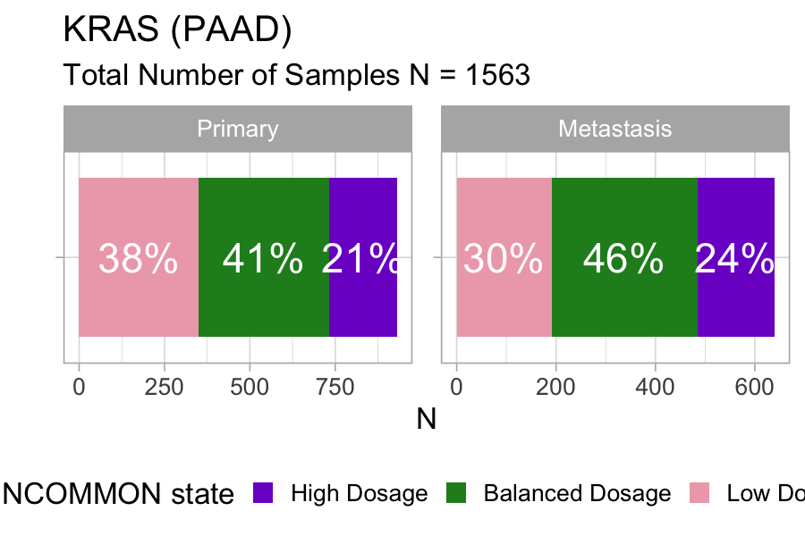
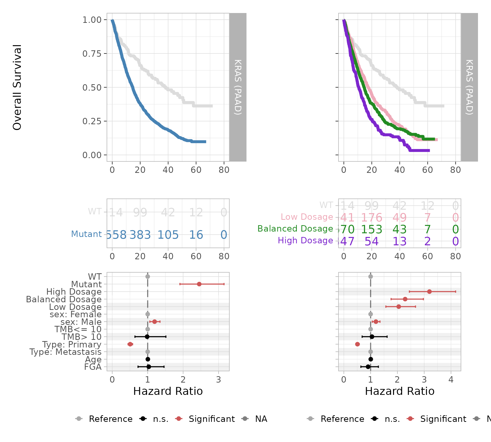

# 4. Survival analysis of MSK-MetTropism

``` r
library(INCOMMON)
#> Warning: replacing previous import 'cli::num_ansi_colors' by
#> 'crayon::num_ansi_colors' when loading 'INCOMMON'
library(dplyr)
#> 
#> Attaching package: 'dplyr'
#> The following objects are masked from 'package:stats':
#> 
#>     filter, lag
#> The following objects are masked from 'package:base':
#> 
#>     intersect, setdiff, setequal, union
library(cli)
```

In this vignette we carry out survival analysis based on INCOMMON
classification of samples of pancreatic adenocarcinoma (PAAD) patients
from the MSK-MetTropsim cohort.

## 4.1 Classification of 1740 prostate adenocarcinoma samples

In order to stratify patients based on the INCOMMON interpreted genomes,
we first need to classify all the mutations in these samples.

### 4.1.1 Input intialisation

First we read the example classified data:

``` r
data("MSK_PAAD_output")
print(MSK_PAAD_output)
#> ── [ INCOMMON ]  175054 PASS mutations across 24018 samples, with 290 mutant gen
#> ℹ Average sample purity: 0.4
#> ℹ Average sequencing depth: 649
#> # A tibble: 7,839 × 186
#>    sample    tumor_type purity chr     from     to ref   alt      NV    DP gene 
#>    <chr>     <chr>       <dbl> <chr>  <dbl>  <dbl> <chr> <chr> <int> <int> <chr>
#>  1 P-0000142 PAAD          0.4 chr12 2.54e7 2.54e7 C     C       273  1404 KRAS 
#>  2 P-0000142 PAAD          0.4 chr17 7.58e6 7.58e6 G     G        53   671 TP53 
#>  3 P-0000142 PAAD          0.4 chr2  4.77e7 4.77e7 T     T        31   481 MSH2 
#>  4 P-0000142 PAAD          0.4 chr5  1.28e6 1.28e6 G     G        34   227 TERT 
#>  5 P-0000783 PAAD          0.8 chr12 2.54e7 2.54e7 C     C       474   941 KRAS 
#>  6 P-0000783 PAAD          0.8 chr5  1.12e8 1.12e8 G     G       164   424 APC  
#>  7 P-0000783 PAAD          0.8 chr11 8.60e7 8.60e7 T     T       210   601 EED  
#>  8 P-0000783 PAAD          0.8 chr13 3.29e7 3.29e7 TC    TC      160   493 BRCA2
#>  9 P-0000879 PAAD          0.6 chr7  1.40e8 1.40e8 A     A       308   736 BRAF 
#> 10 P-0000879 PAAD          0.6 chr1  1.15e8 1.15e8 T     T       188   506 NRAS 
#> # ℹ 7,829 more rows
#> # ℹ 175 more variables: HGVSp_Short <chr>, Entrez_Gene_Id <dbl>, Center <chr>,
#> #   NCBI_Build <chr>, Chromosome <chr>, Strand <chr>, Consequence <chr>,
#> #   Variant_Classification <chr>, Variant_Type <chr>, Tumor_Seq_Allele2 <chr>,
#> #   dbSNP_RS <chr>, dbSNP_Val_Status <lgl>, Matched_Norm_Sample_Barcode <lgl>,
#> #   Match_Norm_Seq_Allele1 <lgl>, Match_Norm_Seq_Allele2 <lgl>,
#> #   Tumor_Validation_Allele1 <lgl>, Tumor_Validation_Allele2 <lgl>, …
```

## 4.2 Survival analysis of Mutant KRAS patients

In order to obtain a grouping of patients based on the mutant dosage of
KRAS, we need first to annotate the FAM and mutant dosage class of each
sample and interpret mutant KRAS genomes.

### 4.2.1 Mutand Dosage Classification

We use the function `mutant_dosage_classification` to add INCOMMON
classes (Mutant with/without LOH, Mutant with/without AMP, Tier-2)
`class` and annotate each sample with a `genotype` summarising all the
interpreted mutations found in the sample.

``` r
MSK_PAAD_output = mutant_dosage_classification(MSK_PAAD_output)
#> Joining with `by = join_by(id)`
```

We investigate the impact on survival of the Mutant KRAS dosage with
respect to KRAS WT patients.

We first look at the distribution of mutant dosage across PAAD samples
for KRAS, using function `plot_class_fraction`:

``` r
plot_class_fraction(x = MSK_PAAD_output, tumor_type = 'PAAD', gene = 'KRAS')
```



Across 1563 samples, a relatively large fraction of KRAS mutations (21%)
is associated with high dosage in primary pancreatic tumours, and the
fraction increases to 24% in metastases.

### 4.2.2 Kaplan-Meier survival esitmates

Next we use function `kaplan_meier_fit` to fit survival data (overall
survival status versus overall survival months in this case) using the
Kaplan-Meier estimator. Notice that we must choose the variables from
`clinical_data` to be used as survival time and survival status
(‘OS_MONTHS’ and ‘OS_STATUS’ in this case).

``` r
MSK_PAAD_output = kaplan_meier_fit(
  x = MSK_PAAD_output, 
  tumor_type = 'PAAD', 
  gene = 'KRAS', 
  survival_time = 'OS_MONTHS', 
  survival_status = 'OS_STATUS')
#> Call: survfit(formula = "survival::Surv(OS_MONTHS, OS_STATUS) ~ group", 
#>     data = data)
#> 
#>    7 observations deleted due to missingness 
#>                   n events median 0.95LCL 0.95UCL
#> WT              214     92   38.3   28.98    51.1
#> Low Dosage      541    344   17.4   15.34    19.8
#> Balanced Dosage 670    417   14.6   13.34    15.8
#> High Dosage     347    237   10.7    9.36    12.5
```

The median overall survival time decreases proportionally to the mutant
KRAS dosage: from 38.3 months for the WT group to 17.4 months for low
mutant dosage, 14.6 months for the balanced mutant dosage, down to 10.7
months for the high mutant dosage.

### 4.2.3 Hazard Ratio estimates with Cox regression

In order to estimate the hazard ratio associated with these groups, we
fit the same survival data, this time using a multivariate Cox
proportional hazards regression model. Here, we overcome the confounding
effect of global mutational and copy-number burden by including the
tumour mutational burden and the fraction of genome altered (FGA)
provided within the clinical data, plus other standard covariates such
as age of patients at sequencing, sex and sample type (primary vs
metastasis). For TMB, best practices require using a value of 10 per
megabase to discriminate patients with high burden from those with low.
We can decide which strategy to use by tuning argument `tmb_method`. The
default value is “median”, which uses the median over all samples
asthreshold. Here, we set it to “\>10” to stick to the mentioned best
practices.

``` r
MSK_PAAD_output = cox_fit(x = MSK_PAAD_output,
        tumor_type = 'PAAD',
        gene = 'KRAS',
        survival_time = 'OS_MONTHS',
        survival_status = 'OS_STATUS',
        covariates = c('AGE_AT_SEQUENCING', 'SEX', 'TMB', 'FGA','SAMPLE_TYPE'),
        tmb_method = ">10")
#> [1] "Cox fit with INCOMMON groups:"
#> Call:
#> survival::coxph(formula = formula %>% stats::as.formula(), data = data %>% 
#>     as.data.frame())
#> 
#>                            coef exp(coef)  se(coef)       z        p
#> groupBalanced Dosage   0.828020  2.288783  0.132845   6.233 4.58e-10
#> groupHigh Dosage       1.161802  3.195687  0.136122   8.535  < 2e-16
#> groupLow Dosage        0.717250  2.048791  0.136201   5.266 1.39e-07
#> AGE_AT_SEQUENCING      0.005402  1.005417  0.002965   1.822  0.06845
#> SEXMale                0.179991  1.197207  0.061022   2.950  0.00318
#> TMB_NONSYNONYMOUS> 10  0.049379  1.050619  0.219603   0.225  0.82209
#> FGA                   -0.098933  0.905803  0.180039  -0.550  0.58266
#> SAMPLE_TYPEPrimary    -0.677310  0.507982  0.064381 -10.520  < 2e-16
#> 
#> Likelihood ratio test=226.3  on 8 df, p=< 2.2e-16
#> n= 1768, number of events= 1088 
#>    (11 observations deleted due to missingness)
#> [1] "Pairwise tests:"
#> 
#>   Simultaneous Tests for General Linear Hypotheses
#> 
#> Fit: survival::coxph(formula = formula %>% stats::as.formula(), data = data %>% 
#>     as.data.frame())
#> 
#> Linear Hypotheses:
#>                                                  Estimate Std. Error z value
#> `groupHigh Dosage` - `groupBalanced Dosage` == 0  0.33378    0.08228   4.057
#> `groupLow Dosage` - `groupBalanced Dosage` == 0  -0.11077    0.07341  -1.509
#>                                                  Pr(>|z|)    
#> `groupHigh Dosage` - `groupBalanced Dosage` == 0 9.93e-05 ***
#> `groupLow Dosage` - `groupBalanced Dosage` == 0     0.234    
#> ---
#> Signif. codes:  0 '***' 0.001 '**' 0.01 '*' 0.05 '.' 0.1 ' ' 1
#> (Adjusted p values reported -- single-step method)
```

This analysis confirms the gradient of worsening survival outcome of
patients with increasing mutant dosage of KRAS. The evaluated hazard
ratios increase from 2.04 for Low Dosage, to 2.29 for Balanced Dosage,
up to 3.20 for High Dosage. The pairwise analysis reveals that the
outcome difference between High and Balanced dosage is significant
(P-value $P = 9.93 \times 10^{- 5}$), confirming the effectiveness of
mutant dosage as an outcome predictive factor for overall survival.

### 4.2.4 Visualising survival analysis

Kaplan-Meier estimation and multivariate Cox regression can be
visualized straightforwardly using the `plot_survival_analysis`
function:

``` r
plot_survival_analysis(x = MSK_PAAD_output,
                       tumor_type = 'PAAD',
                       gene = 'KRAS')
#> Scale for x is already present.
#> Adding another scale for x, which will replace the existing scale.
#> Scale for x is already present.
#> Adding another scale for x, which will replace the existing scale.
#> Joining with `by = join_by(var)`
#> Joining with `by = join_by(var)`
#> Warning: Removed 3 rows containing missing values or values outside the scale range
#> (`geom_point()`).
#> Warning: Removed 1 row containing missing values or values outside the scale range
#> (`geom_point()`).
```



The plot displays Kaplan-Meier survival curves and risk table, and a
forest plot for Cox multivariate regression coefficients, highlighting
in red the covariates that have a statistically significant contribution
to differences in hazard risks.
