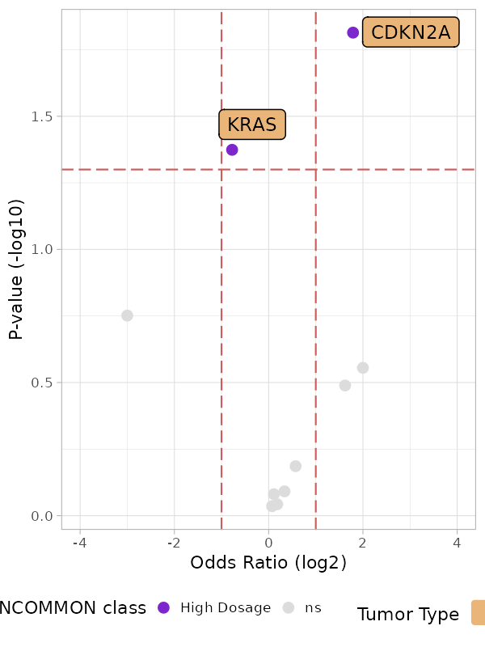
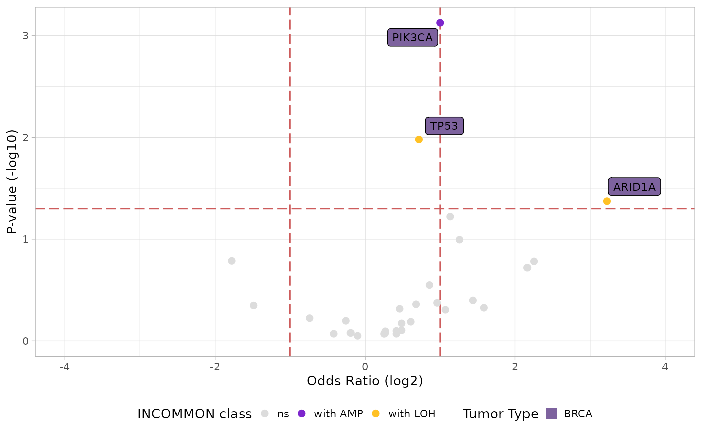

# 5. Analysis of metastatic patterns of MSK-MetTropism

``` r
library(dplyr)
#> 
#> Attaching package: 'dplyr'
#> The following objects are masked from 'package:stats':
#> 
#>     filter, lag
#> The following objects are masked from 'package:base':
#> 
#>     intersect, setdiff, setequal, union
library(INCOMMON)
#> Warning: replacing previous import 'cli::num_ansi_colors' by
#> 'crayon::num_ansi_colors' when loading 'INCOMMON'
library(cli)
```

In this vignette we carry out survival analysis based on INCOMMON
classification of samples of pancreatic cancer (PAAD) patients of the
MSK-MetTropsim cohort.

## 5.2 Metastatic propensity of PAAD samples

### 5.2.1 Metastatic propensity of fully incactivated TP53

We can analyse the metastatic propensity of primary breast tumor genomes
containing TP53 mutations by using function `met_propensity`. This
function implements a logistic regression to fit the Binomial
probability of developing metastasis based on the interpreted mutant
genome, with the mutant gene without CNA (here, Mutant TP53 without LOH)
as reference.

``` r
data("MSK_PAAD_output")
MSK_PAAD_output = met_propensity(x = MSK_PAAD_output, tumor_type = 'PAAD', gene = 'CDKN2A')
#> Joining with `by = join_by(id)`
#> Waiting for profiling to be done...
#> Waiting for profiling to be done...
#> # A tibble: 1 × 6
#>   gene   class          OR   low    up p.value
#>   <chr>  <chr>       <dbl> <dbl> <dbl>   <dbl>
#> 1 CDKN2A High Dosage  3.46  1.21  9.24  0.0153
```

From this analysis it emerges that high dosage CDKN2A have more than a
three-fold increase in risk to metastatise (OR = 3.46, p.value = 0.015)
with respect to mutant samples a balanced mutant dosage.

### 5.2.2 Metastatic propensity for the top mutant genes in BRCA

We extend this analysis to multiple genes, focusing on the 10 most
frequently mutated ones.

``` r
top_genes = MSK_PAAD_output$input %>% 
  dplyr::group_by(gene) %>% 
  dplyr::reframe(N = length(unique(sample))) %>% 
  dplyr::arrange(dplyr::desc(N)) %>% 
  dplyr::slice_head(n = 10) %>% 
  pull(gene)

print(top_genes)

for(g in top_genes){
  MSK_PAAD_output = met_propensity(x = MSK_PAAD_output, tumor_type = 'PAAD', gene = g)
}
```

### 5.2.2 Visualising metastatic propensity odds ratio

INCOMMON provides the function `plot_met_volcano` to visualise
metastatic propensity odds ratios in a volcano plot.

``` r
plot_met_volcano(x = MSK_PAAD_output, tumor_type = 'PAAD')
```



In addition to CDKN2A, among the 10 most frequently mutant genes in
PAAD, a high dosage of KRAS seems to reduce the risk of metastatisation
(OR = 0.59, p.value = 0.04). Given the strong worsening of survival
outcomes related to high KRAS dosage in PAAD, this effect may be
explained by the fact that the death rate in this configuration is high
enough not to allow the annotation of metastases in the patients’
electronic health records.

## 5.3 Metastatic tropism of BRCA samples

### 5.3.1 Tropism to liver metastases of KRAS pancreatic cancer with high dosage

We can analyse the organotropism of metastatic pancreatic tumor genomes
containing KRAS mutations by using function `met_tropsim`. Similarly to
the metastatic propensity analysis, this function implements a logistic
regression to fit the Binomial probability of developing metastasis
towards a specific metastatic site (here the Liver, as example), based
on the mutant gene dosage, with the balanced dosage as reference.

``` r
MSK_PAAD_output = met_tropism(MSK_PAAD_output, tumor_type = 'PAAD', gene = 'KRAS', metastatic_site = 'Liver')
#> Waiting for profiling to be done...
#> Waiting for profiling to be done...
#> # A tibble: 1 × 7
#>   gene  metastatic_site class          OR   low    up p.value
#>   <chr> <chr>           <chr>       <dbl> <dbl> <dbl>   <dbl>
#> 1 KRAS  Liver           High Dosage  1.72  1.09  2.77  0.0232
```

There is odds ratio (OR) of metastatising to the Liver for high dosage
KRAS mutant pancreatic cancer is almost two-fold (OR = 1.71, p.value =
0.023) with respect to mutant samples with balanced dosage.

### 5.3.2 Tropism of top mutant genes in PAAD to the Liver

We extend this analysis to multiple genes, focusing on the 10 most
frequently mutated ones and the top 10 most frequent metastatic sites.

``` r
top_sites = MSK_PAAD_output$clinical_data %>% 
  dplyr::filter(METASTATIC_SITE != 'Unspecified') %>% 
  dplyr::group_by(METASTATIC_SITE) %>% 
  dplyr::reframe(N = length(unique(sample))) %>% 
  dplyr::arrange(dplyr::desc(N)) %>% 
  dplyr::slice_head(n = 10) %>% 
  pull(METASTATIC_SITE)

for(g in top_genes[1:10]){
  for(m in top_sites){
   MSK_PAAD_output = met_tropism(MSK_PAAD_output, gene = g, tumor_type = 'PAAD', metastatic_site = m) 
  }
}
```

### 5.3.3 Visualising metastatic tropism

INCOMMON provides the function `plot_tropism` to visualise metastatic
tropism odds ratios by metastatic site.

``` r
plot_tropism(x = MSK_PAAD_output, tumor_type = 'PAAD')
```



Interestingly, a high dosage of KRAS only increases the odds of
metastatisation to the liver, among the first 10 most frequent
metastatisation sites, highlighting a very specific organotropic pattern
for this mutant dosage configuration.
